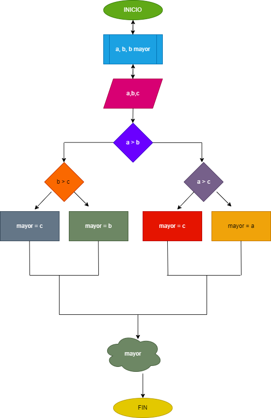

# Ejercicio 2 estructuras condicionales

## Programas para hallar el mayor de tres números enteros

## ANALISIS

### Definición de variables

a: primer número
b: segundo número
c: tercer número
mayor: número mayorse comparan los tres valores entre si para hallat el mas grande

## DISEÑO

